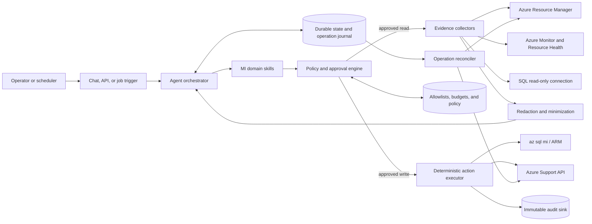
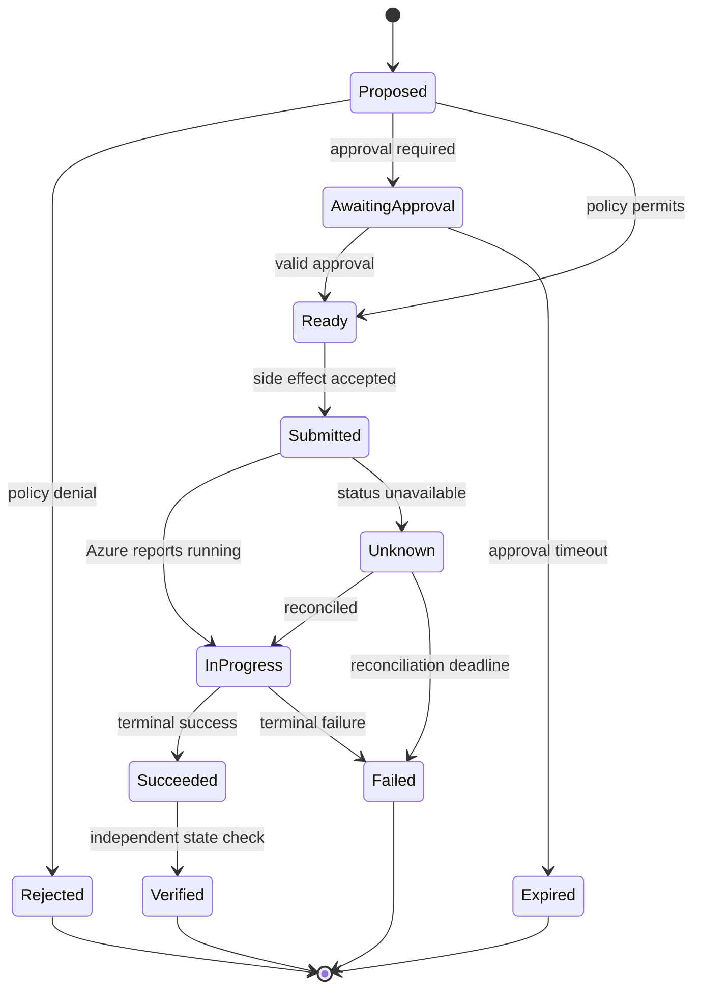
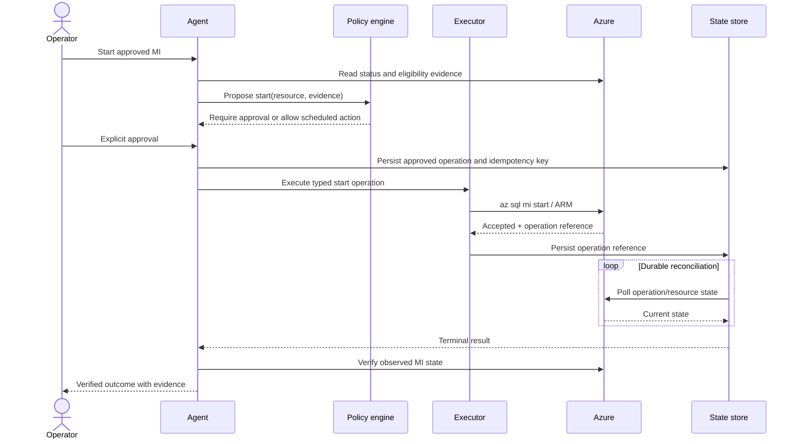

# Architecture

> **Capability status:** Proposed design. No component described here is implemented, deployed, tested against Azure, or validated in a customer tenant by this repository.

## Design goals

- Keep operator intent, policy decisions, execution, and verification separate.
- Use deterministic tools for Azure and SQL operations; use the language model for planning, evidence synthesis, and drafting.
- Require explicit authorization for consequential actions.
- Survive restarts and duplicate requests without losing operation state or repeating side effects.
- Keep domain skills portable across a self-hosted agent and Azure SRE Agent.

## Logical architecture

The language model never receives unrestricted credentials and does not execute arbitrary shell commands. Skills produce typed action proposals. The policy engine evaluates each proposal, and a deterministic executor invokes only allowlisted commands or API operations.

## Components

### Agent orchestrator

Interprets operator intent, selects a skill, requests missing non-sensitive context, and presents evidence or approval prompts. It must not represent a proposal as an executed action.

### MI domain skills

The four MVP skills define stable contracts:

- `mi-manage`: status, start, stop, and scheduling.
- `mi-troubleshoot`: read-only evidence collection and diagnosis.
- `mi-capacity`: capacity analysis and resize recommendations.
- `mi-escalate`: support request drafting and explicitly authorized creation.

Each skill declares allowed tools, required inputs, preconditions, prohibited actions, output schema, and verification steps.

### Policy and approval engine

Evaluates:

- Caller identity and role.
- Subscription, resource group, and MI resource allowlists.
- Requested action and environment risk tier.
- Change window and schedule policy.
- Approval requirement and approval freshness.
- Per-resource and global action budgets.
- Duplicate or conflicting operations.
- Data classification and redaction policy.

Policy decisions are explicit records with a policy version and reason codes.

### Evidence collectors

Collectors use separate identities and permissions where appropriate:

- Azure control-plane collector for resource properties, activity logs, metrics, alerts, and health.
- SQL collector for approved DMVs and catalog views.
- Support prerequisite collector for plan and API readiness.

Azure RBAC does not imply SQL DMV access. SQL evidence collection requires a separately configured SQL principal with only the required server/database permissions.

### Deterministic action executor

The executor exposes a small operation catalog rather than a general command shell.

| Operation | Proposed mechanism | Approval |
|---|---|---|
| Get MI status/configuration | ARM or `az sql mi show` | No mutable-action approval |
| Start MI | ARM or `az sql mi start` | Explicit approval or pre-approved schedule |
| Stop MI | ARM or `az sql mi stop` | Explicit approval or pre-approved schedule |
| Resize MI | Not executable in MVP | Not applicable |
| Create support request | Azure Support API | Explicit per-ticket approval |

Azure SQL MCP may be used for capabilities it actually exposes, but it is not the lifecycle control path because MI start/stop is not currently exposed there.

### Durable state and operation journal

Long-running control-plane operations must not be tied to a single chat turn or process lifetime. The state store records:

- Canonical request and correlation identifiers.
- Idempotency key and deduplication scope.
- Target resource ID and desired state.
- Caller, approver, policy decision, and approval expiration.
- Azure request/operation identifiers and polling URL when available.
- Current state, attempts, timestamps, and terminal result.
- Verification evidence and user-visible summary.

Recommended states:

The reconciler resumes polling after restart, applies bounded backoff, respects Azure retry guidance, and raises an operator-visible exception when status remains unknown.

## Primary flows

### Status and start/stop

Eligibility is always checked at runtime. The system must handle unsupported configurations, already-satisfied state, conflicting operations, maintenance events, and policy restrictions without issuing a lifecycle command.

### Troubleshooting

Troubleshooting is read-only:

1. Establish incident window, symptom, resource, and user-visible impact.
2. Collect allowlisted Azure evidence.
3. If SQL access is configured and authorized, collect allowlisted DMV evidence.
4. Normalize timestamps and correlate evidence.
5. Produce findings with source, time range, confidence, and evidence gaps.
6. Recommend reversible next steps or escalation; do not execute SQL or resize actions.

### Capacity recommendation

The agent evaluates sustained utilization, saturation, workload trend, storage growth, and operational context. It records assumptions and proposes one or more candidate target configurations. Recommendations require human review and remain non-executable in the MVP.

### Support escalation

The agent may draft a support request from redacted evidence. Before creation it verifies support entitlement and required API prerequisites, displays the exact proposed payload, and obtains explicit per-ticket authorization. Ticket updates or attachments also require authorization when they disclose new data.

## Identity and authorization boundaries

Use workload identity or managed identity where available. Separate identities are preferred for:

- Read-only Azure evidence.
- MI lifecycle execution.
- SQL read-only diagnostics.
- Support request creation.

The executor identity should receive only the minimum actions at the narrowest practical resource scope. Resource allowlists are an additional application control and do not replace Azure RBAC.

## Deployment paths

### Self-hosted `microsoft/azure-skills` path

The organization hosts the orchestrator, policy service, durable state, scheduler, and audit pipeline. This path offers the most control and can reuse free skills from `microsoft/azure-skills`, but the operator owns availability, upgrades, secure execution, and observability.

### Azure SRE Agent path

Domain skill intent, policy requirements, and evidence contracts are mapped to Azure SRE Agent capabilities. This can reduce platform ownership, but suitability depends on available connectors/actions, identity isolation, approval semantics, durable operation handling, regional/product availability, and governance controls. These items require tenant validation before adoption.

### Portability boundary

Keep these artifacts platform-neutral:

- Skill input/output schemas.
- Policy decision schema.
- Evidence envelope and redaction labels.
- Operation journal model.
- Audit event schema.
- Approval contract.

Platform adapters implement tool invocation, identity, scheduler, state, and user experience.

## Reliability requirements

- At-least-once workflow execution with idempotent side effects.
- Optimistic concurrency or leases for per-resource operations.
- One active mutable MI operation per resource unless Azure explicitly supports concurrency.
- Backoff, jitter, and bounded retries for transient failures.
- Dead-letter handling for operations that cannot be reconciled.
- Independent post-action verification; API acceptance is not success.
- Health metrics for queue depth, approval latency, operation age, failures, duplicate suppression, and reconciliation gaps.

## Validation plan

Before claiming implementation or tenant validation:

1. Unit-test policy, state transitions, idempotency, redaction, and recommendation logic.
2. Contract-test Azure and Support API adapters with recorded, sanitized responses.
3. Test failure injection for process restarts, duplicate delivery, throttling, timeout, and ambiguous Azure status.
4. Exercise read-only flows against a non-production MI.
5. Exercise lifecycle operations only on an approved, eligible test MI.
6. Confirm SQL permissions cannot mutate schema or data.
7. Confirm support-ticket creation in a tenant with known entitlement using an approved test procedure.
8. Record evidence and limitations; do not generalize one tenant result to all tenants.
