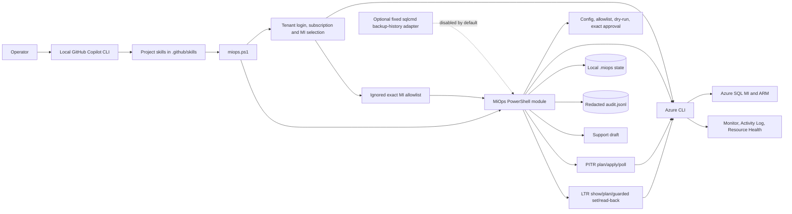
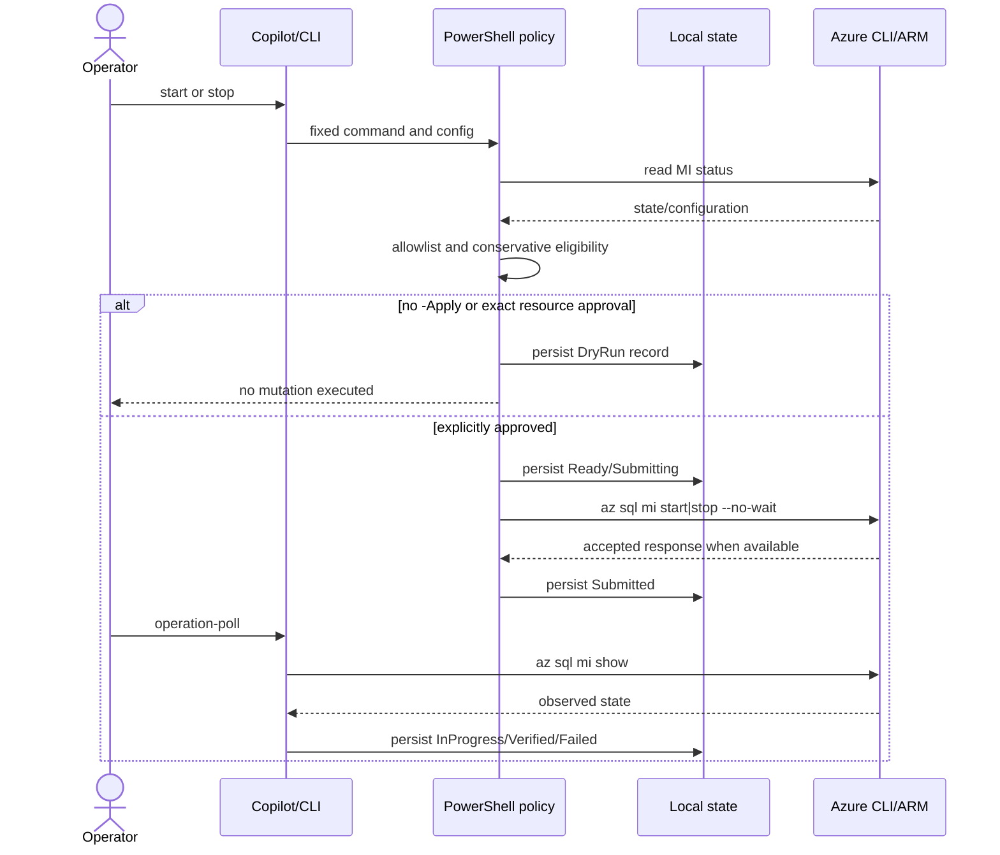
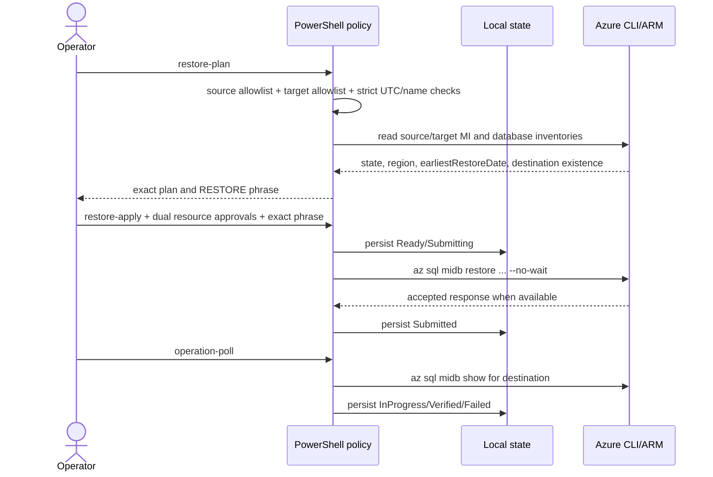
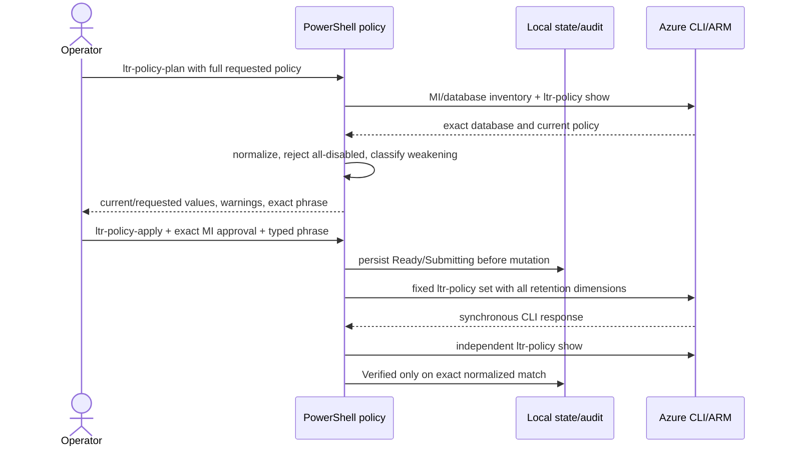

# Architecture

> **Status:** The local PowerShell runtime, safeguards, state, audit, evidence collection, and support drafting are implemented and locally tested. Azure tenant/MI behavior remains unvalidated.

## Chosen phase-1 architecture

The MVP is intentionally a local, inspectable tool rather than a hosted service. Copilot CLI selects and explains operations; deterministic PowerShell enforces the safety boundary and invokes only fixed Azure CLI command shapes.

Azure SRE Agent is not shown in the runtime because it is not required. A future migration may map these skills and safeguards to it after capability, governance, availability, and cost validation.

## Repository components

| Component | Responsibility | Status |
|---|---|---|
| `.github/skills/*/SKILL.md` | Canonical project-scoped Copilot discovery and safe command guidance | Implemented |
| `miops.ps1` | Stable CLI command dispatcher | Implemented, locally tested |
| `src/MiOps.psm1`, `src/MiOps.BackupRestore.ps1`, and `src/MiOps.LtrPolicy.ps1` | Setup, config/policy, Azure adapters, database/backup shaping, LTR policy control, PITR planning/submission/polling, state, audit, evidence, support draft | Implemented, locally tested without Azure |
| `config/miops.example.json` | Checked-in schema/example for one MI | Implemented |
| `config/miops.local.json` | Operator-owned local configuration | Ignored |
| `.miops/operations` | Durable local operation records | Implemented |
| `.miops/audit.jsonl` | Redacted local audit log | Implemented |
| SQL adapter | Fixed `backup-history-v1` query through `sqlcmd -G`, bounded and disabled by default | Implemented, not tenant/network validated |
| Support API submission | Entitlement-aware ticket creation | Not implemented |

## Onboarding and interactive flow

`setup` invokes the fixed Azure CLI browser login command for a tenant domain/GUID, or adds `--use-device-code` when requested. Authentication is completed by the operator locally; credentials and login results are not persisted. Using core `az account list --all` metadata, the flow resolves the tenant to a GUID, lists only accessible enabled subscriptions for that tenant, sets and independently verifies the active account, and runs the fixed `az sql mi list --subscription <id>` discovery command. No Azure CLI extension is required.

The selected MI is displayed with operational metadata and requires a typed `CONFIGURE <mi-name>` confirmation. Only then is ignored `config/miops.local.json` created or updated from the checked-in example, with the same exact resource ID in `resource.id` and the sole `allowedResourceIds` entry.

`interactive` is a presentation layer over existing deterministic functions. Read and dry-run choices execute immediately. Start/stop apply choices first read and display the exact MI name, resource ID, and current state, then require `START <mi-name>` or `STOP <mi-name>`. The internally supplied approval remains the exact configured allowlisted resource ID.

## Lifecycle flow

The local GUID is always captured. An Azure operation identifier is also stored if Azure CLI returns one. Because `az sql mi ... --no-wait` may return no body, later polling uses the authoritative resource state. API acceptance is never labeled verified completion.

## Database backup and restore flow

`database-list` reads the exact source MI, refuses non-source-allowlisted IDs, checks MI availability, calls the fixed `az sql midb list` shape, excludes system databases, and normalizes current CLI schema differences.

`backup-check` combines:

- ARM database state and earliest restore boundary where exposed.
- STR policy per database.
- LTR policy and LTR backup records when configured or required.
- Restorable deleted database evidence.
- Explicit Azure permission/API gaps.
- Optional recent `msdb` history from one fixed SQL query.

ARM is the durable evidence source but does not expose every individual STR full/differential/log record. SQL history provides recent transparency only and can be absent or incomplete.

The target list is independent from source `allowedResourceIds`; inventory and discovery never populate it. Same-instance restore also requires explicit target configuration. `Verified` requires the destination database to be `Online` with successful provisioning.

## LTR policy flow

`ltr-policy-show`, `ltr-policy-plan`, and `ltr-policy-apply` reuse the exact source MI allowlist and user-database inventory. Requested values are closed to single-unit normalized durations (`P<n>D`, `P<n>W`, `P<n>M`, `P<n>Y`) or `PT0S` for one disabled dimension, with documented 7-day minimum, 10-year maximum, and week 1-52 validation. Units are not tied to the weekly/monthly/yearly selector; this follows the MI REST contract rather than Azure SQL Database assumptions.

Normal changes use `SET LTR ...`. Any shorter retention or removal of an enabled dimension is blocked unless a separate reduction switch and full `REDUCE LTR ...` phrase are both present. No path clears all dimensions or deletes an LTR policy. All three retention dimensions are explicitly passed to `set`; the runtime does not depend on omitted-value behavior in Azure CLI's create-or-update implementation.

## Schedule boundary

Azure CLI exposes `az sql mi start-stop-schedule`. Phase 1:

- Inspects the default schedule.
- Produces a local review plan.
- Can explicitly delete an existing schedule, guarded like other mutations.

It does not create or update schedules because that would enable automatic stop, which is outside this phase.

## Evidence architecture

`evidence` collects, where available:

- Current MI ARM properties.
- Activity Log for a bounded window.
- Current Resource Health.
- Configured Azure Monitor metrics that are advertised by the resource.

Unavailable permissions, metrics, providers, or features become `evidenceGaps`; no synthetic data is substituted. The bundle states that SQL evidence is absent.

## SQL diagnostics boundary

Azure RBAC and SQL data-plane authorization are independent. The optional adapter:

- Authenticates through `sqlcmd -G` with a separate least-privilege Microsoft Entra SQL identity.
- Executes only the fixed read-only `backup-history-v1` query.
- Apply timeout, row limit, and redaction.
- Avoid requiring `sysadmin`.

It accepts no password/token/connection string or arbitrary SQL input. Missing tooling, network reachability, authentication, or permission becomes an evidence gap; no data is inferred or faked.

## Support escalation boundary

The implemented command produces a local redacted case draft from an evidence bundle. REST submission is disabled and absent. A future adapter must prove support-plan entitlement, provider/API readiness, authorization, duplicate handling, exact payload approval, and verified ticket creation.

## Cost and runtime ownership

The repository and public skill definitions may be used as open-source code, but runtime costs remain environment-specific. Copilot/model access, Azure resources, Azure Monitor/Log Analytics, storage/networking, and Microsoft Support can incur charges. The operator owns workstation security, Azure identity, state backup, audit export, and operational validation.

## Reliability limitations

Local JSON files provide restart persistence on one workstation, not distributed coordination or high availability. Phase 1 does not implement leases across hosts, immutable audit storage, background polling, or scheduler execution. Only one operator/process should mutate a given MI at a time until a shared state backend is added.
